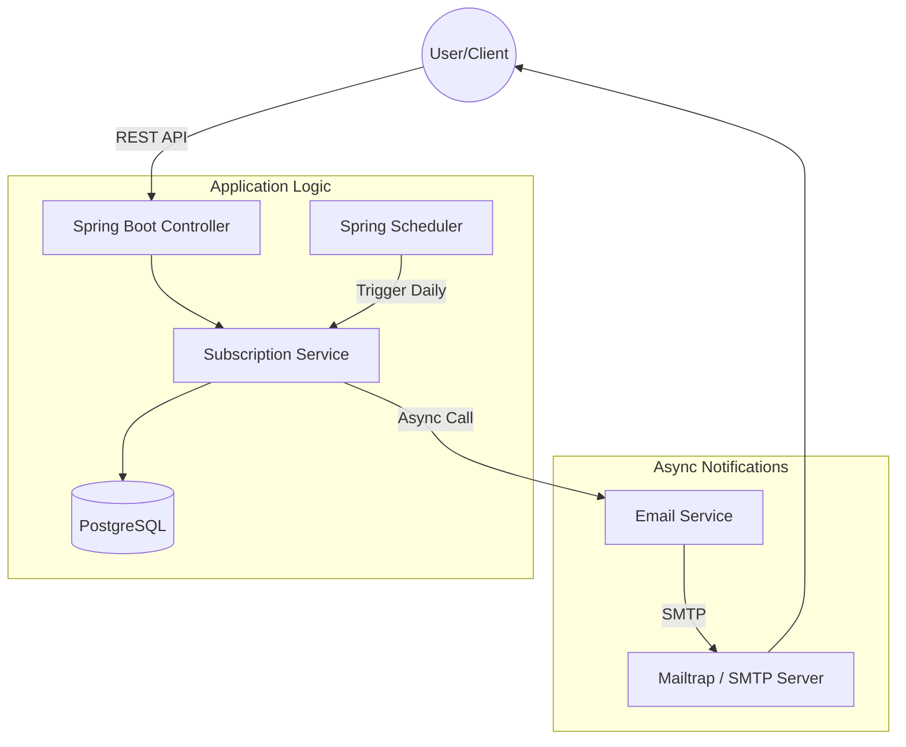
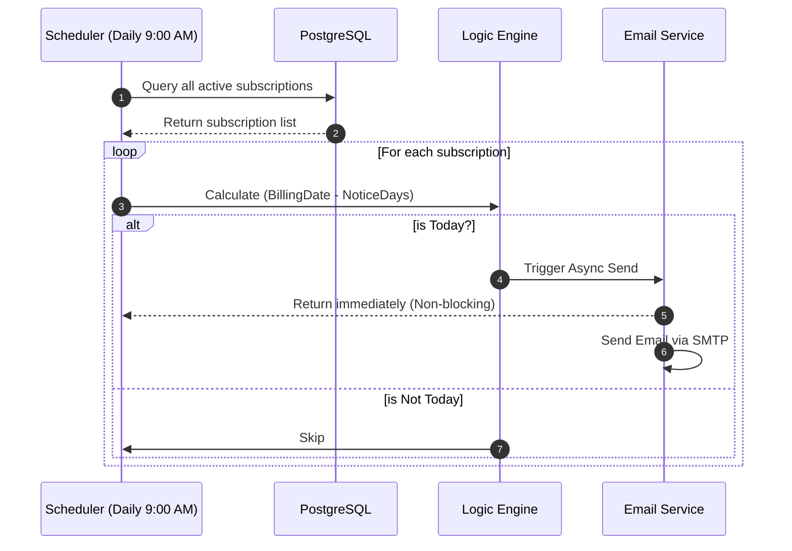

# 🚀 Subscription Tracker Service

[](https://www.oracle.com/java/)
[](https://spring.io/projects/spring-boot)
[](https://www.docker.com/)
[](https://www.postgresql.org/)

A robust, enterprise-ready backend solution designed to manage recurring subscriptions and prevent unwanted charges through automated, schedule-driven email alerts.

---

## 📌 Project Overview
As modern services shift toward subscription-based models, users often struggle with "hidden costs" from forgotten trials or recurring bills. This project provides a centralized **RESTful API** to track subscriptions and an **Automated Reminder Engine** that proactively notifies users before the next billing cycle.

### Key Features
* **Subscription Lifecycle Management (CRUD):** Complete API for creating, reading, updating, and deleting subscription records.
* **Automated Reminder Engine:** Utilizes **Spring Scheduling** to perform daily database scans for upcoming billing events based on Cron expressions.
* **Asynchronous Email Service:** Integrated with **Spring Mail** (SMTP) and enhanced with `@Async` processing to ensure non-blocking notification delivery.
* **Containerized Infrastructure:** Fully orchestrated with **Docker & Docker Compose** for seamless deployment and environment consistency.
* **Secure Configuration:** Implements **Environment Variable** management (`.env`) to protect sensitive credentials and API keys.

---

## 🏗️ System Architecture
The system follows a **Layered Architecture** to ensure high maintainability and separation of concerns:


* **Controller Layer**: Handles RESTful HTTP requests and JSON response mapping.
* **Service Layer**: Orchestrates business logic, including the calculation of reminder lead times.
* **Repository Layer**: Manages data persistence via **Spring Data JPA** and **PostgreSQL**.
* **Scheduling Layer**: Triggers automated tasks and manages asynchronous thread execution for notifications.

---

## 🛠️ Tech Stack
* **Backend:** Java 21 (LTS), Spring Boot 3.x
* **Persistence:** Spring Data JPA, Hibernate
* **Database:** PostgreSQL 15
* **Automation:** Spring Scheduling, `@Async` Thread Pooling
* **DevOps:** Docker, Docker Compose
* **Testing Tooling:** Mailtrap (SMTP Sandbox), Postman

---

## 🚀 Getting Started

### Prerequisites
* Docker & Docker Compose
* Java 21 (for local development)
* Maven

### 1. Configuration
Create a `.env` file in the root directory and provide your SMTP credentials (recommended to use [Mailtrap](https://mailtrap.io/)):
```bash
MAILTRAP_USERNAME=your_14_digit_id
MAILTRAP_PASSWORD=your_password
```

### 2. Build the Application
* Compile the source code and package it into a JAR file:
```bash
./mvnw clean package -DskipTests
```

### 3. Launch with Docker
* Spin up both the application and the database containers:
```bash
docker-compose up --build -d
```
* The API will be accessible at http://localhost:8080.

---

## 🔌 API Documentation (Sample)
|Method|Endpoint|Description|
|---|---|---|
|`GET`|`/api/subscriptions`|Retrieve all active subscriptions|
|`POST `|`/api/subscriptions`|Create a new subscription entry|

### Sample Request Body:
```json
{
  "name": "Netflix",
  "price": 390.0,
  "currency": "TWD",
  "nextBillingDate": "2026-04-15",
  "period": "MONTHLY",
  "noticeDays": 3
}
```
---

## 💡 Engineering Highlights
* **Decoupled Design:** Used `@Async` to separate the notification engine from the main scheduling thread, preventing system bottlenecks during mass mailing.
* **Docker Networking:** Leveraged Docker Compose service discovery (e.g., `jdbc:postgresql://db:5432/...`) to ensure reliable inter-container communication.
* **Clean Code Practices:** Heavily utilized Lombok to reduce boilerplate and adhered to **RESTful** design principles for predictable API behavior.

---

### System Architecture


### Workflow: Automatic Reminder

