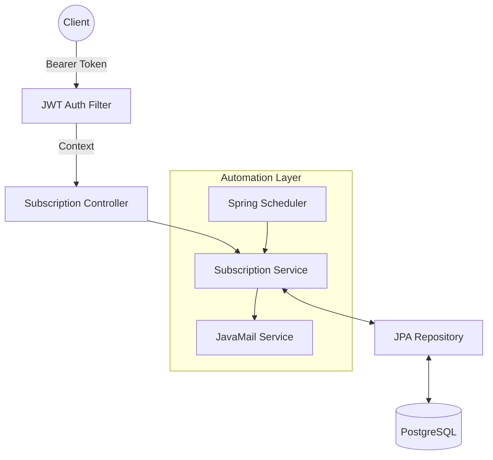
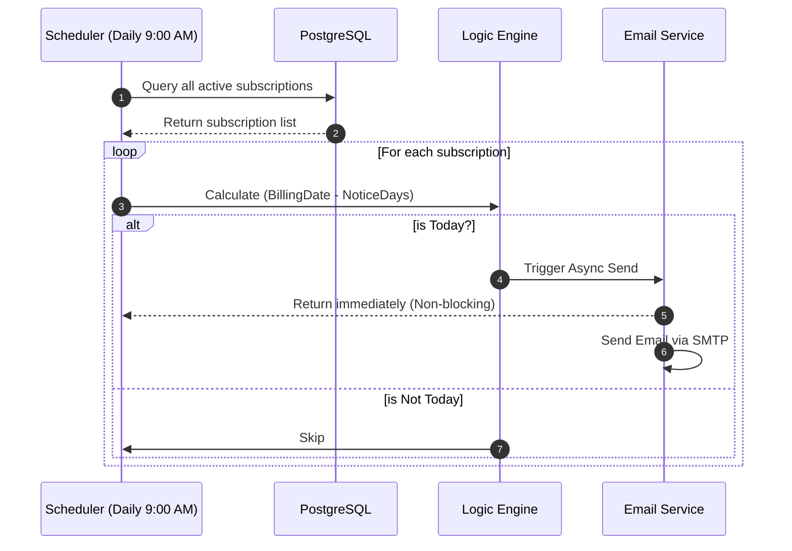

# 🚀 Subscription Tracker Service

[](https://www.oracle.com/java/)
[](https://spring.io/projects/spring-boot)
[](https://www.docker.com/)
[](https://www.postgresql.org/)

A robust, enterprise-ready backend solution designed to manage recurring subscriptions and prevent unwanted charges through automated, schedule-driven email alerts.

---

## 📌 Project Overview
As modern services shift toward subscription-based models, users often struggle with "hidden costs" from forgotten trials or recurring bills. This project provides a centralized **RESTful API** to track subscriptions and an **Automated Reminder Engine** that proactively notifies users before the next billing cycle.

### Key Features
* **Subscription Lifecycle Management (CRUD):** Complete API for creating, reading, updating, and deleting subscription records.
* **Automated Reminder Engine:** Utilizes **Spring Scheduling** to perform daily database scans for upcoming billing events based on Cron expressions.
* **Asynchronous Email Service:** Integrated with **Spring Mail** (SMTP) and enhanced with `@Async` processing to ensure non-blocking notification delivery.
* **Containerized Infrastructure:** Fully orchestrated with **Docker & Docker Compose** for seamless deployment and environment consistency.
* **Secure Configuration:** Implements **Environment Variable** management (`.env`) to protect sensitive credentials and API keys.

---

## 🏗️ System Architecture
The system follows a **Layered Architecture** to ensure high maintainability and separation of concerns:


* **Controller Layer**: Handles RESTful HTTP requests and JSON response mapping.
* **Service Layer**: Orchestrates business logic, including the calculation of reminder lead times.
* **Repository Layer**: Manages data persistence via **Spring Data JPA** and **PostgreSQL**.
* **Scheduling Layer**: Triggers automated tasks and manages asynchronous thread execution for notifications.

---

## 🛠️ Tech Stack
* **Backend:** Java 21 (LTS), Spring Boot 3.x
* **Persistence:** Spring Data JPA, Hibernate
* **Database:** PostgreSQL 15
* **Automation:** Spring Scheduling, `@Async` Thread Pooling
* **DevOps:** Docker, Docker Compose
* **Testing Tooling:** Mailtrap (SMTP Sandbox), Postman

---

## 🌟 Backend Features & Logic

### 1. Secure Authentication Flow
The system implements a hybrid authentication model. It handles Google OAuth2 callbacks via a custom `OAuth2LoginSuccessHandler`, which validates the user in the PostgreSQL database and issues a signed JWT for subsequent stateless requests.

### 2. Multi-Tenant Data Isolation
Data integrity is maintained through a **One-to-Many** relationship between `User` and `Subscription` entities. Every API request is intercepted by a JWT Filter that injects the user context, ensuring that users can only CRUD data belonging to their own `uid`.

### 3. Automated Reminder Engine
A dedicated `@Scheduled` service scans the database daily to identify subscriptions approaching their `next_billing_date`. It triggers the `JavaMailSender` to dispatch notification emails to the specific user's registered address.

### 4. Resilient Database Integration
Configured to handle cloud-native database connections, including specific handling for reverse-proxy headers (`X-Forwarded-Proto`) and optimized HikariCP connection pooling.

---

## 🚀 Getting Started

### Prerequisites
* Docker & Docker Compose
* Java 21 or higher.
* Maven 3.9+.
* Google Cloud Project: An active OAuth 2.0 Client ID and Secret.

### 1. Local Setup
#### 1. Clone the repository:
```bash
git clone https://github.com/pizzaInmystomach/Subscription-Tracker.git
cd Subscription-Tracker
```

#### 2. Environment Configuration
Create a `.env` file in the root directory (this file is ignored by Git for security):
```env
# Database
SPRING_DATASOURCE_URL=jdbc:postgresql://localhost:5432/subtracker
SPRING_DATASOURCE_USERNAME=postgres
SPRING_DATASOURCE_PASSWORD=your_password

# Security
JWT_SECRET=your_32_character_random_string
GOOGLE_CLIENT_ID=your_google_id
GOOGLE_CLIENT_SECRET=your_google_secret

# Notifications
MAIL_USERNAME=your_gmail@gmail.com
MAIL_PASSWORD=your_gmail_app_password
```

### 2. Execution Paths
* **Standard Maven Run** (Faster for UI/Logic changes):
  ```bash
  mvn spring-boot:run
  ```
* **Docker Compose** (Tests the full production-like environment):
  ```bash
  docker-compose up --build
  ```

---

## Deployment & Environment
The system is designed for **Cloud-Native Deployment**, utilizing a multi-stage Docker build to ensure a lightweight and secure production image.

### 🐳 Multi-Stage Dockerfile
The `Dockerfile` is optimized to separate the build environment from the runtime environment:
* **Build Stage**: Uses maven:3.9.6-eclipse-temurin-21 to compile the source code and run mvn package.
* **Runtime Stage**: Uses eclipse-temurin:21-jdk-alpine to execute the resulting app.jar, significantly reducing the attack surface and image size.

### ⚙️ Production Environment Variables (Render/Heroku)
When deploying to platforms like **Render**, configure the following variables in the dashboard:

|Category|Key|Value/ Example|
|---|---|---|
|Database|`SPRING_DATASOURCE_URL`|`jdbc:postgresql://<host>:5432/<db_name>`|
|Auth|`JWT_SECRET`|High-entropy random string|
|OAuth2|`GOOGLE_CLIENT_ID`|From Google Cloud Console|
|Proxy|`SERVER_FORWARD_HEADERS_STRATEGY`|`framework`(Required for HTTPS over Proxy)|
|Mail|`MAIL_PASSWORD`|16-digit Google App Password|

### 🛠️ Reverse Proxy Configuration
Since the backend operates behind a Load Balancer on Render, the application is configured to respect `X-Forwarded-Proto` headers. This prevents `redirect_uri_mismatch` errors during Google OAuth2 authentication by ensuring the backend generates `https` links instead of `http`.

---

## 🔌 API Endpoints (RESTful)
|Method|Endpoint|Description|Auth|
|---|---|---|---|
|`GET`|`/api/subscriptions`|Retrieve all active subscriptions|Public|
|`POST `|`/api/subscriptions`|Create a new subscription entry|JWT|
|`POST `|`/auth/login`|Google OAuth2 Entry Point|JWT|
|`PUT`|`/api/subscriptions/{id}`|Update existing subscription|JWT|
|`DELETE`|`/api/subscriptions/{id}`|Remove a subscription|JWT|

---

## 💡 Engineering Highlights
* **Decoupled Design:** Used `@Async` to separate the notification engine from the main scheduling thread, preventing system bottlenecks during mass mailing.
* **Docker Networking:** Leveraged Docker Compose service discovery (e.g., `jdbc:postgresql://db:5432/...`) to ensure reliable inter-container communication.
* **Clean Code Practices:** Heavily utilized Lombok to reduce boilerplate and adhered to **RESTful** design principles for predictable API behavior.

---

### System Architecture


### Workflow: Automatic Reminder

